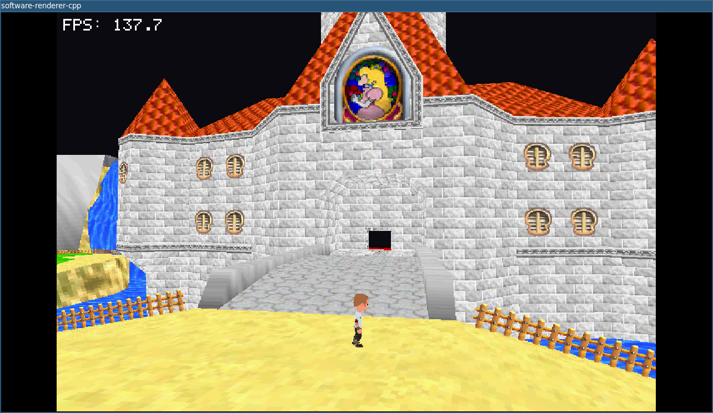

# software-renderer-cpp

A CPU software renderer and gameplay sandbox in C++20 using SDL2.



## Current Features

- CPU triangle rasterization with depth buffer
- Textured materials, face culling, winding controls, and debug toggles
- Asset loading:
  - OBJ + MTL static scene (`peaches_castle.obj`)
  - FBX skinned mesh + FBX animation clips (idle/run/jump)
  - glTF loader module (for static model ingestion)
- Character controller:
  - third-person follow camera + hold-`Tab` status camera blend
  - sphere-vs-triangle collision against world mesh
  - slope handling, step-up support, gravity toggle, and jump coyote time
- CPU skeletal animation:
  - bind/inverse-bind joint pipeline
  - linear blend skinning (LBS) on CPU each frame
  - animation state switching (idle/run/jump), including run speed scaling
- Built-in FPS HUD and configurable internal render resolution

## Controls

- `W/A/S/D`: move
- `Shift`: sprint
- `Space`: jump
- `Mouse`: look (when mouse look is enabled)
- `Tab` (hold): status camera
- `Esc`: quit

Runtime toggles:

- `M`: toggle mouse look / cursor lock
- `C`: toggle backface culling
- `V`: flip winding
- `T`: force castle double-sided rendering
- `G`: toggle gravity

## Build and Run

Install dependencies (Ubuntu):

```bash
./install_deps.sh
```

Quick build + run:

```bash
./compile_and_run.sh
```

Useful build script options:

```bash
./compile_and_run.sh --dev
./compile_and_run.sh --debug
./compile_and_run.sh --valgrind
```

Manual CMake flow:

```bash
cmake -S . -B build_cpp -DCMAKE_BUILD_TYPE=Release
cmake --build build_cpp -j
./build_cpp/renderer
```

## CLI Options

```bash
./build_cpp/renderer --help
```

Supported:

- `--render-w N`, `--render-h N`: internal render resolution
- `--window-w N`, `--window-h N`: SDL window size
- `--no-fps`: disable FPS overlay

## Assets

This app expects:

- `assets/models/peaches_castle.obj`
- `assets/materials/peaches_castle.mtl`
- textures under `assets/textures/`
- Kenney character + animation FBX files under `assets/models/kenney/` and `assets/anims/kenney/`

## Docs

Architecture and implementation notes are in `docs/`.
